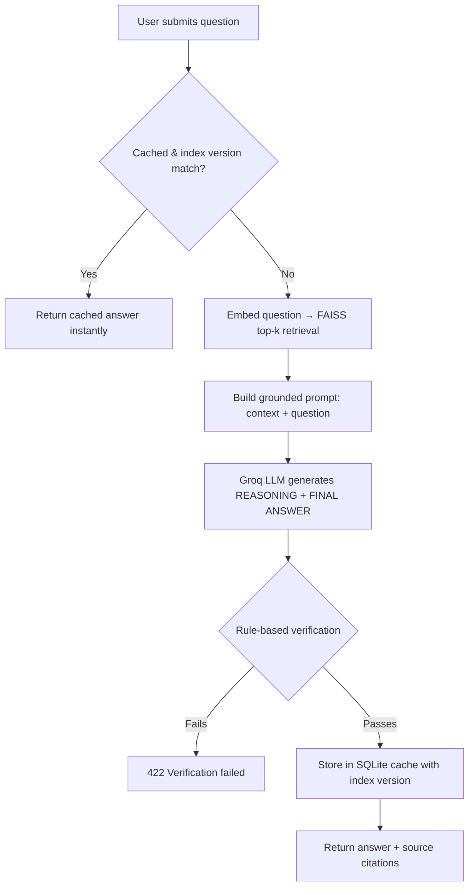

<div align="center">

# 🧠 RAG-Based Verified AI Response System
### Reducing LLM Hallucinations Through Retrieval, Grounding & Rule-Based Verification


</div>

---

<h2>📌 Overview</h2>

<p>
Large Language Models are fluent but not always faithful — they can generate confident, well-structured
answers that are factually wrong (<i>hallucinations</i>). This project builds a <b>Retrieval-Augmented
Generation (RAG) pipeline</b> that forces the model to answer only from a verified, self-curated knowledge
base scraped from real web sources, then runs every response through a <b>rule-based verification layer</b>
before it ever reaches the user. If the model can't ground its answer in the retrieved context, it's required
to say so explicitly rather than guess.
</p>

<h2>✨ Features</h2>

<p><b>Live Web Scraping:</b> Ingests knowledge from any URL — BeautifulSoup-based extraction, deduplicated via MD5 hashing, with per-source citation tracking.</p>

<p><b>Semantic Chunking + Embedding:</b> Scraped text is chunked and embedded with <code>sentence-transformers (all-MiniLM-L6-v2)</code> for dense vector search.</p>

<p><b>FAISS Vector Retrieval:</b> Sub-second top-k similarity search over the embedded knowledge base using <code>IndexFlatL2</code>.</p>

<p><b>Grounded Answer Generation:</b> Retrieved context is injected into the prompt sent to a Groq-hosted LLM, with an explicit instruction to answer <i>only</i> from the provided context.</p>

<p><b>Rule-Based Verification Layer:</b> Every answer is checked for minimum length, structured step-by-step reasoning, and uncertainty-phrase leakage before being served — answers that fail verification are rejected outright (HTTP 422), not silently returned.</p>

<p><b>Version-Aware Caching:</b> Verified answers are cached in SQLite keyed by a SHA-256 hash of the normalized question, tagged with a knowledge-base version fingerprint — so a cached answer is automatically invalidated the moment the knowledge base changes underneath it.</p>

<p><b>Source Citations:</b> Every answer returns the exact source URLs its context was pulled from, so claims are traceable back to origin.</p>

<p><b>Background Index Rebuilding:</b> Scraping a new URL triggers an async FAISS rebuild without blocking the API or restarting the server.</p>

<h2>🏗️ System Architecture</h2>



<h2>🛠️ Tech Stack</h2>

| Layer | Technology |
|---|---|
| Backend API | Flask + Flask-CORS |
| Embeddings | sentence-transformers (`all-MiniLM-L6-v2`) |
| Vector Search | FAISS (`IndexFlatL2`) |
| LLM Inference | Groq API |
| Caching / Storage | SQLite |
| Web Scraping | Requests + BeautifulSoup4 |
| Frontend | HTML / CSS / vanilla JS |
| Testing | Pytest |

<h2>⚙️ Setup</h2>

```bash
git clone https://github.com/srikarikurukunda/RAG-aisyst.git
cd RAG-aisyst

python -m venv venv
venv\Scripts\activate        # Windows
# source venv/bin/activate   # macOS / Linux

pip install -r requirements.txt
```

<h2>🔑 Environment Variables (`.env`)</h2>

```
GROQ_API_KEY=your-groq-api-key
FLASK_SECRET_KEY=any-random-word-you-make-up
FAISS_INDEX_PATH=faiss_index/index.faiss
CHUNKS_PATH=faiss_index/chunks.json
SQLITE_DB_PATH=answers.db
```

<h2>▶️ Running the Application</h2>

<ol>
<li><b>Scrape a source page</b> into the knowledge base (or POST to <code>/scrape</code> once the server is running):</li>
</ol>

```bash
python backend/scraper.py
```

<ol start="2">
<li><b>Build the FAISS index</b> from everything in <code>knowledge_base/</code>:</li>
</ol>

```bash
python scripts/build_index.py
```

<ol start="3">
<li><b>Start the Flask server:</b></li>
</ol>

```bash
cd backend
python app.py
```

<ol start="4">
<li>Open <code>frontend/index.html</code> through a local server (e.g. <code>python -m http.server</code>) and start asking questions.</li>
</ol>

<h2>🧪 Testing</h2>

```bash
pytest tests/ -v
```

<h2>📡 API Endpoints</h2>

| Method | Endpoint | Description |
|---|---|---|
| `POST` | `/ask` | Ask a question → `{answer, source, timestamp, verified, sources}` |
| `POST` | `/scrape` | Scrape a URL into the knowledge base and rebuild the index in the background |
| `GET` | `/scrape/status` | Poll background index-rebuild status |
| `POST` | `/cache/clear` | Wipe the answer cache |
| `GET` | `/health` | Health check |

<h2>🌍 Applications</h2>

<p><b>Academic Research Assistants:</b> Answering questions strictly from a curated set of papers or course material, with zero risk of the model inventing citations.</p>

<p><b>Internal Knowledge Bases:</b> Company wikis and documentation where a wrong answer is worse than no answer.</p>

<p><b>Legal & Compliance Q&A:</b> Domains where hallucinated case law or policy (as seen in real incidents like <i>Mata v. Avianca</i>) is a liability, not just an inconvenience.</p>

<p><b>Fact-Checked News Summarization:</b> Grounding answers in specific, citable articles rather than the model's general training knowledge.</p>

<h2>⚠️ Limitations</h2>
<ul>
  <li>Verification is rule-based (length, structure, phrase detection) — not a true semantic groundedness check against the retrieved context yet</li>
  <li>Knowledge base is only as current as the last scrape — no scheduled re-crawling</li>
  <li>Retrieval always returns the top-k matches regardless of how weak the similarity score is</li>
  <li>Single-node SQLite cache — not designed for concurrent multi-instance deployment</li>
</ul>

<h2>🚀 Future Enhancements</h2>
<ul>
  <li><b>Real groundedness verification:</b> Replace/augment the rule-based checks with a genuine context-similarity score (closer to the base paper's approach), or a second LLM call that grades whether the answer is actually supported by the retrieved context</li>
  <li><b>Relevance threshold on retrieval:</b> Fall back to "not found in knowledge base" when FAISS's best match is still too distant to trust</li>
  <li><b>File upload ingestion:</b> Accept PDF/TXT uploads directly, not just scraped URLs</li>
  <li><b>Containerization:</b> Dockerfile / docker-compose for one-command setup</li>
  <li><b>CI pipeline:</b> Run the existing pytest suite automatically on every push via GitHub Actions</li>
  <li><b>Source management endpoint:</b> List and remove individual sources from the knowledge base without wiping the whole index</li>
</ul>

---

<div align="center">
<sub>Built as part of a CSE mini-project at Gokaraju Lailavathi Engineering College.</sub>
</div>
